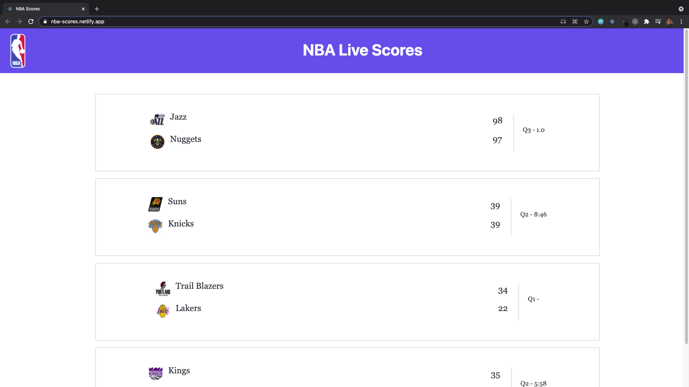

# NBA Live Scores

A simple React app to display live scores from the NBA API. This mini project also uses the Context API as well as the useContext and useReducer hooks for state management.

[Live Demo](https://nba-scores.netlify.app/)

